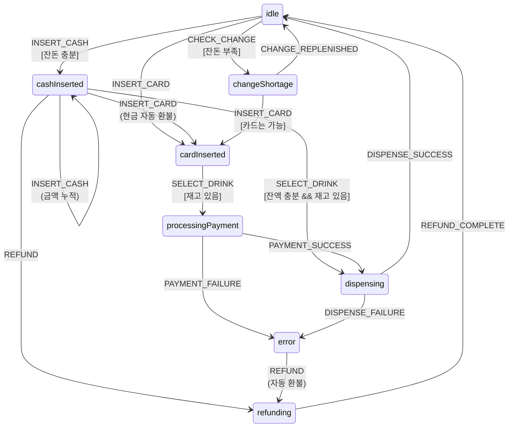

# 🥤 Vending Machine with xstate

**실제 현실 세계의 자판기를 철저하게 모방한 시뮬레이터**

xstate v5 State Machine을 사용한 Next.js 기반 자판기 프로젝트입니다.

## 🎯 철학

### 1. Spec Driven Development (SDD)
- **Requirement** → **Design** → **Task** 순서로 개발
- 모든 구현은 `specs/` 문서에서 시작
- 문서와 코드의 일치 보장

### 2. 현실 세계 모방
- 실제 자판기처럼 동작: 버튼을 눌렀는데 조건이 안 맞으면 아무 일도 일어나지 않음 (Silent Failure)
- 자동 환불: 카드 삽입 시 현금 자동 환불, 에러 발생 시 자동 환불
- 잔돈 관리: 실제 화폐 단위별 개수 추적 (10원~50,000원)

### 3. xstate 기반 상태 관리
- 모든 상태와 전환을 State Machine으로 명시적 관리
- Guard 조건으로 유효하지 않은 전환 차단
- Context로 자판기 데이터 (잔액, 재고, 잔돈) 관리

## 📐 State Machine



## 🏗️ 아키텍처

### 기술 스택
- **Next.js 16** (App Router, Server Actions)
- **React 19** (Client Components)
- **TypeScript** (완전한 타입 안정성)
- **xstate v5** (상태 머신)
- **Tailwind CSS** (스타일링)
- **Vitest** (테스트)

### 구조
```
src/
├── machines/         # xstate 상태 머신
├── hooks/            # useVendingMachine 훅
├── components/       # React 컴포넌트
├── types/            # TypeScript 타입 정의
└── utils/            # 비즈니스 로직 (잔돈 계산 등)

specs/
├── requirement/      # 요구사항 정의
├── design/           # 설계 문서
└── task/             # 구현 작업 목록
```

## 🚀 시작하기

```bash
# 설치
pnpm install

# 개발 서버 실행
pnpm dev

# 테스트 실행
pnpm test
```

## 📋 주요 기능

- ✅ **현금 결제**: 10원~50,000원 투입, 실시간 잔돈 계산
- ✅ **카드 결제**: 재고만 있으면 즉시 구매 가능
- ✅ **재고 관리**: 음료별 재고 추적 및 품절 표시
- ✅ **잔돈 관리**: 화폐 단위별 보유량 추적, 부족 시 현금 투입 차단
- ✅ **환불 처리**: 수동 환불 + 자동 환불 (에러 시)
- ✅ **개발자 콘솔**: 내부 상태 실시간 확인

## 🧪 테스트

```bash
# 단위 테스트
pnpm test

# 커버리지
pnpm test:coverage
```

State Machine의 모든 상태 전환과 Guard 조건을 테스트합니다.

## 📚 문서

상세한 설계와 구현은 `specs/` 폴더를 참고하세요:

1. **Requirement** (`specs/requirement/`): 무엇을 만들지 정의
2. **Design** (`specs/design/`): 어떻게 구현할지 설계
3. **Task** (`specs/task/`): 실제 구현 작업 목록

## 🎨 UI 특징

- **버튼 상태별 시각화**
  - `disabled`: 재고 없음 (회색, 비활성)
  - `active`: 선택 가능 (기본)
  - `purchasable`: 구매 가능 (강조, 녹색 링)

- **실시간 피드백**
  - 금액 표시
  - 잔돈 상태 알림
  - 음료 배출 애니메이션

## 🔧 개발 원칙

1. **타입 안전성**: 모든 함수와 컴포넌트에 명시적 타입
2. **단일 책임**: 각 컴포넌트와 함수는 하나의 역할만
3. **테스트 가능성**: 순수 함수로 비즈니스 로직 분리
4. **명시적 상태**: xstate로 모든 상태 전환을 코드로 표현
