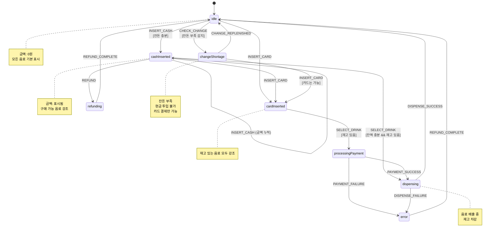

# 자판기 상태 머신 설계 (xstate)

## 목적
xstate를 사용하여 자판기의 모든 상태와 전환을 관리

## 상태 정의

### idle (대기)
- 초기 상태
- 금액: 0원
- 모든 버튼 클릭 가능하지만 조건 미충족 시 아무 동작 없음

### cashInserted (현금 투입됨)
- 현금이 투입된 상태
- 투입 금액 표시
- 구매 가능한 음료 버튼이 구매 가능 상태로 표시

### cardInserted (카드 삽입됨)
- 카드가 삽입된 상태
- 재고 있는 모든 음료가 구매 가능 상태로 표시

### processingPayment (결제 처리 중)
- 카드 결제 승인 요청 중
- 모든 버튼 비활성화

### dispensing (음료 배출 중)
- 음료 배출 진행 중
- 모든 버튼 비활성화

### refunding (환불 중)
- 현금 환불 진행 중
- 모든 버튼 비활성화

### changeShortage (잔돈 부족)
- 자판기 잔돈이 부족한 상태
- 현금 투입 불가, 현금 구매 불가
- 카드 결제는 가능

### error (오류)
- 시스템 오류 발생
- 자동 환불 처리 후 idle로 복귀

## 이벤트 정의

### INSERT_CASH
- payload: `{ amount: number }`
- guard: `changeAvailable === true`
- idle → cashInserted
- cashInserted → cashInserted (금액 누적)
- changeShortage 상태에서는 무시됨

### INSERT_CARD
- idle → cardInserted
- cashInserted → cardInserted (현금 자동 환불)

### SELECT_DRINK (현금)
- payload: `{ drinkId: string, price: number }`
- guard: `balance >= price && stock > 0`
- cashInserted → dispensing

### SELECT_DRINK (카드)
- payload: `{ drinkId: string, price: number }`
- guard: `stock > 0`
- cardInserted → processingPayment

### PAYMENT_SUCCESS
- processingPayment → dispensing

### PAYMENT_FAILURE
- processingPayment → error

### DISPENSE_SUCCESS
- dispensing → idle (현금 잔액 차감)
- dispensing → idle (카드는 잔액 없음)

### DISPENSE_FAILURE
- dispensing → error

### REFUND
- cashInserted → refunding (현금만 가능)

### REFUND_COMPLETE
- refunding → idle
- error → idle

### CHECK_CHANGE
- 시스템에서 주기적으로 잔돈 확인
- 잔돈 부족 감지 시 → changeShortage
- 잔돈 충분하면 → idle

### CHANGE_REPLENISHED
- changeShortage → idle

## Context (상태 데이터)

```typescript
type ChangeReserve = {
  10: number;      // 10원 개수
  50: number;      // 50원 개수
  100: number;     // 100원 개수
  500: number;     // 500원 개수
  1000: number;    // 1000원 개수
  5000: number;    // 5000원 개수
  10000: number;   // 10000원 개수
  50000: number;   // 50000원 개수
};

type VendingMachineContext = {
  balance: number;              // 현재 투입 금액 (사용자)
  changeReserve: ChangeReserve; // 자판기 보유 잔돈 (화폐별 개수)
  changeAvailable: boolean;     // 잔돈 충분 여부
  paymentMethod: 'cash' | 'card' | null;
  selectedDrink: Product | null; // 선택된 음료
  products: Product[];          // 음료 목록 (재고 포함)
  errorMessage: string | null;
};
```

## Mermaid 다이어그램



## 상태 전환 규칙

### 조용한 실패 (Silent Failure)
버튼 클릭 시 guard 조건 미충족이면 이벤트 무시:
- 재고 없는 음료 선택 → 아무 일도 안 일어남
- 잔액 부족한데 음료 선택 → 아무 일도 안 일어남
- 잔액 0원인데 환불 버튼 → 아무 일도 안 일어남

### 자동 환불
- 카드 삽입 시 현금이 있으면 자동 환불
- 배출 실패 시 자동 환불
- 카드 결제 실패 시 자동 환불

## xstate 구현 위치
- `src/machines/vendingMachine.ts`: 상태 머신 정의
- `src/hooks/useVendingMachine.ts`: React hook으로 래핑

